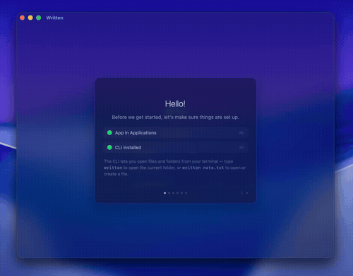

# Written

A distraction-free plaintext writing app for macOS.



## Features

- **12 themes** — solid and translucent, with adjustable glass opacity
- **20 curated fonts** — serif, sans, mono, plus system fonts
- **Vim mode** — normal, visual, operators (d/y/p), word motions, counts
- **Keyboard-driven everything** — settings, sidebar, file management, all navigable with h/j/k/l
- **Typewriter scrolling** with optional cursor follow
- **Line focus highlight** — gradient glow on the current line
- **Column layout** with adjustable width
- **Sidebar file browser** — navigate, rename, delete, filter, sort
- **Auto-save** with crash-safe drafts
- **CLI tool** for quick access from the terminal

See more in [Demos](DEMOS.md).

## Install

### Homebrew

```bash
brew tap heheoppsy/written
brew install --cask written
```

### Download

Grab the latest DMG from [Releases](https://github.com/heheoppsy/written/releases) and drag Written to Applications.

Since the app isn't signed with an Apple Developer certificate, macOS will block the first launch. Fix it once with:

```bash
xattr -cr /Applications/Written.app
```

Or right-click the app → Open → Open Anyway.

### Build from source

Requires Swift 6.0+ and macOS 15 (Sequoia).

```bash
swift build -c release
./Scripts/bundle.sh
open .build/Written.app
```

Or build a DMG directly:

```bash
./Scripts/dmg.sh
```

### CLI

The tutorial will offer to install the CLI for you. Or do it manually:

```bash
cp .build/release/WrittenCLI /usr/local/bin/written
```

```bash
written              # Open in current directory
written file.txt     # Open or create file
written ~/notes      # Open folder in sidebar
```

## FAQ

### Did you write this by hand

Oh goodness gracious no. (Thanks, Claude)

### Well doesn't that mean there are a million bugs

Probably! Please [open an issue](https://github.com/heheoppsy/written/issues) if you find one.

### Will you add support for markdown / code / rich text

No, it's for .txt files and nothing else. [Obsidian](https://obsidian.md/) is a much better choice for workflows that need markdown.

### Why no App Store

$99 USD just for code signing is absurd.

### Why did you even bother when there is Vim, Obsidian, WriteRoom, TextEdit, iA, etc

I liked WriteRoom a lot but development stopped a long time ago.  It's still using TextKit (1) and is compiled for 32 bit x86.
Vim doesn't do enough for plain writing and even with plugins it can be cumbersome.
Obsidian is a little too heavy for me and I get distracted trying to make use of all the cool markdown features.

## License

MIT — see [LICENSE](LICENSE).

Bundled fonts are provided under the [SIL Open Font License 1.1](https://openfontlicense.org/).

